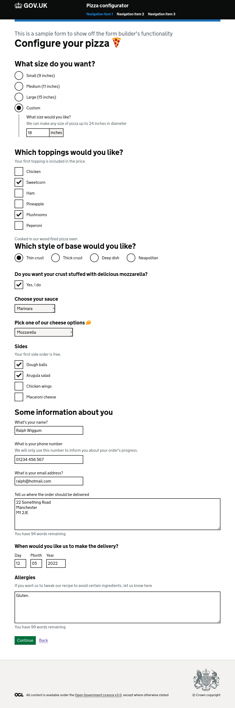

# GOV.UK Design System Formbuilder Demo App

## Prerequisites

- Ruby 2.7.1
- PostgreSQL
- NodeJS 12.13.x
- Yarn 1.12.x

## Setting up the app in development

1. Run `bundle install` to install the gem dependencies
2. Run `yarn` to install node dependencies
3. Run `bin/rails db:setup` to set up the database development and test schemas, and seed with test data
4. Run `bundle exec rails server` to launch the app on http://localhost:3000
5. Run `./bin/webpack-dev-server` in a separate shell for faster compilation of assets
6. Navigate to `http://localhost:3000`

## Preview

